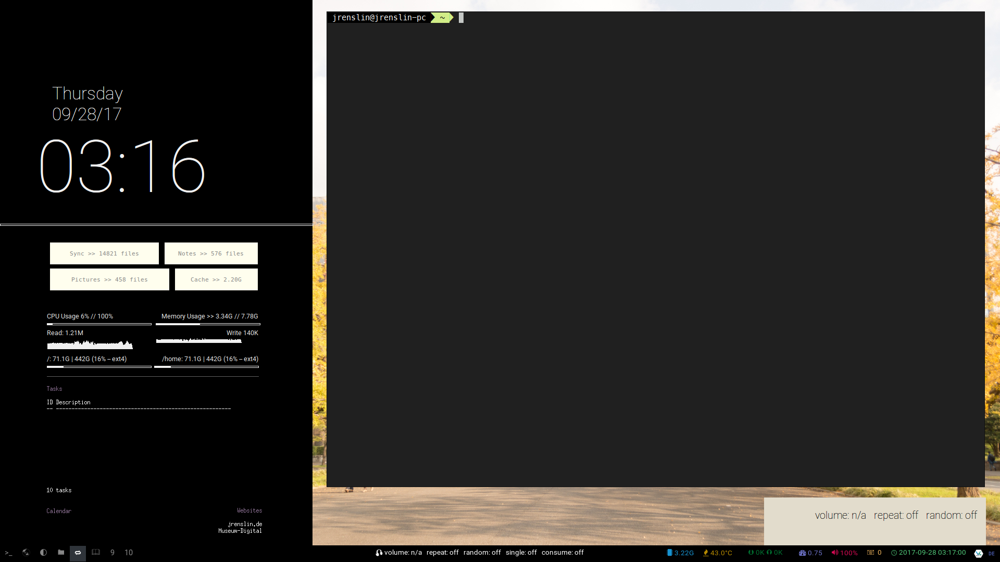

# Dotfiles

My dotfiles. I'm running Debian Testing. 

## Structure

I'm using `stow` to keep my dotfiles in one place. As I got different themes, I split them up:

1. `general` is always stowed and contains configuration files that are unrelated to style and color
2. `comfy`, `juicy`, `seoul`, and `summer` contain style-related files. If styling cannot be distinguished from other settings for a given program, the programs config file(s) is/are kept here, too.

For this split to work properly, `stow` should only set up symlinks to files, not to whole folders. To prevent it from setting up folders, the folders must have been created beforehand. This can be done via the [`install.sh`](#installsh) script included in this repository.

*Note: The newsbeuter config is an excemption from this general rule. I'm synchronizing my* `.newsbeuter` *folder to keep the same database on my laptop and my workstation.*

### Split folders

Because of the split structure, configuration files of some programs are split, too. Namely:

mutt
: The color settings are in the theme-specific folders (located at `<folder>/.mutt/mutt.colors`). Everything else can be found in `general/.mutt`.

## Setup

| Purpose           | Program                                         | Note                                    |
| ------------      | ----------------------------------------        | ------------------------------------    |
| WM                | `Openbox` (laptop),  `i3-gaps` (workstation)    |                                         |
| GTK theme         | `Arc`                                           |                                         |
| Shell             | `zsh`                                           |                                         |
| Terminal emulator | `termite`, `gnome-terminal`                     |                                         |
| Text Editor       | `Emacs`                                         | Using `Spacemacs`                       |
| Mail Client       | `mutt`                                          | Synchronization: `offlineimap`, `msmtp` |
| Calendar          | `khal`                                          | Synchronization: `vdirsyncer`           |
| Contact           | `khard`                                         | Synchronization: `vdirsyncer`           |
| File manager      | `Nautilus`                                      |                                         |
| RSS reader        | `Newsbeuter`                                    |                                         |
| Music player      | `mpd`, `mpc`, `ncmpcpp`                         |                                         |
| Status bar        | `tint2` (laptop), `i3blocks-gaps` (workstation) |                                         |
| Video player      | `mpv`                                           |                                         |

## Scripts

### switch-theme.sh

A script for switching themes. Takes two arguments:

```
./switch-theme.sh <currently loaded theme> <target theme>
```

The script unstows the given config files and stows the target ones. Then it reloads the given WM's (`i3` or `openbox`) configuration. In a next step, it kills dunst and all running instances of conky. Finally it starts conky with the appropriate configuration files for the target theme and sets the background image.

*Note: The script takes some time to execute, as there is a* `sleep 1` *command executed between starting each instance of conky. Without this, the conky instances may not start up properly (especially if one is using an SSD).*

### install.sh

*Back up your .bashrc / .zshrc before using this script. Don't run before reading what it does!*

A script for an initial setup. It does the following things:

1. Loop over folders the different configuration files are stored in and create them if they do not yet exist
2. Remove files that likely exist and would block `stow` from setting up symlinks.
3. Install all packages listed in `general/.pkgs` via `apt-get` 
4. Install all packages listed in `general/.pkgs-pip3` via `pip3` 
5. Clone all git repositories listed in `general/.pkgs-from-git` to `~/git-src`
6. Stow files

## To-Do

| File / Program    | To-Do                                          | Problem                                     |
| ----------------- | ---------------------------------------------- | ------------------------------------------- |
| `.xinitrc`        | Get .xinitrc to recognize my different systems | Find out how to escape hyphens in hostnames |
| `switch-theme.sh` | Include check for hostname with conky configs  |                                             |

## Thanks

Some sources that were extremely helpful are:

- pascalpoitras' [WeeChat configuration](https://gist.github.com/pascalpoitras/8406501)
- Although I'm using Debian, the Arch Wiki.

## Screenshots





## Notes

The Seoul theme is based on the color selection of the city of Seoul, but does not follow the common Seoul colorschemes (e.g. for <a href="https://github.com/junegunn/seoul256.vim">vim</a> or <a href="https://github.com/anandpiyer/seoul256-emacs">emacs</a>) except for the used <a href="https://github.com/anandpiyer/seoul256-emacs">emacs theme</a>.
